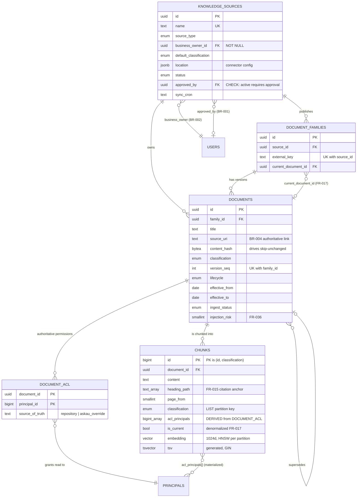
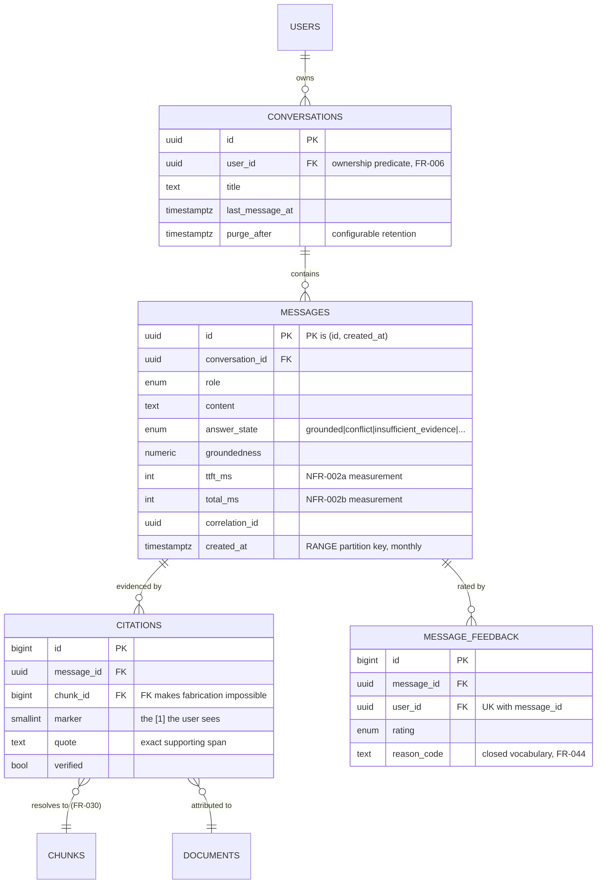
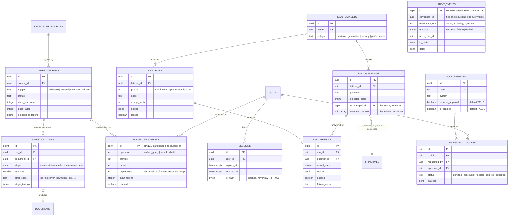
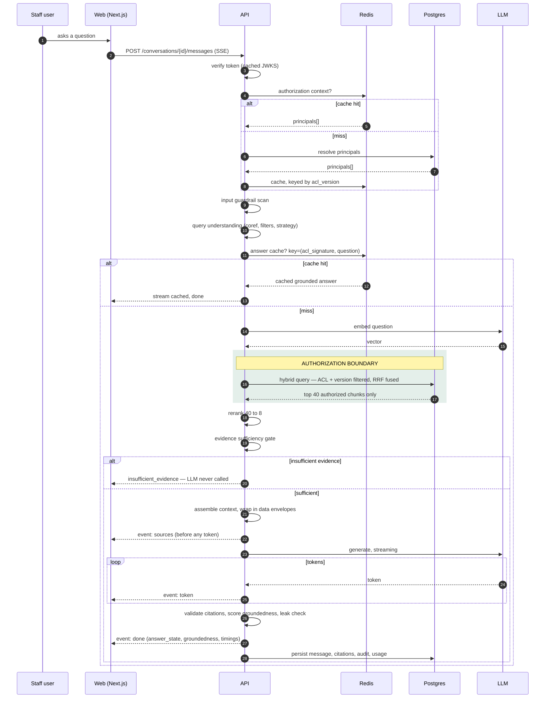
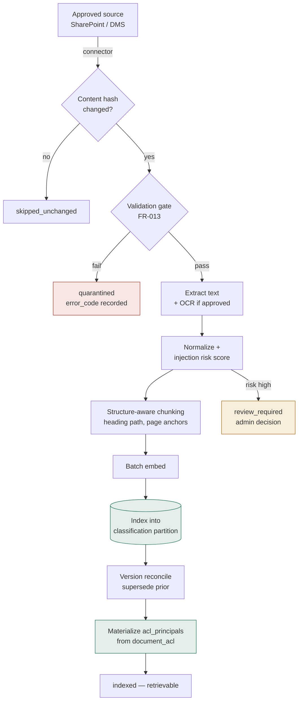
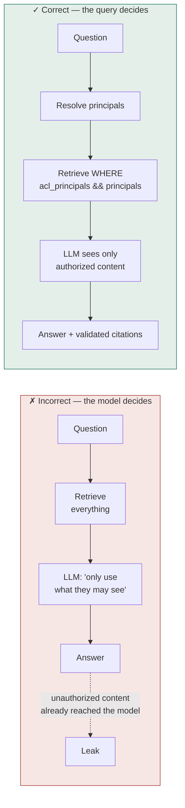
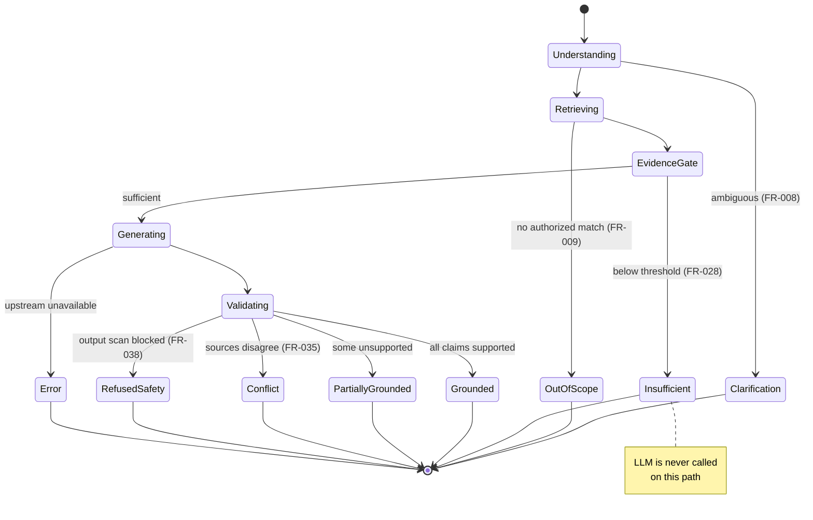

# AskAU — Data Model & Flow Diagrams

Closes the gap the SRS names in Appendix C: *"Entity-relationship diagrams for the
knowledge, user, and conversation data models (Section 4.1) shall be produced during
detailed data modeling and added to this appendix prior to baselining."*

Also supplies the analysis models referenced as Figures C-1, C-2 and C-3.

---

## 1. Knowledge data model



**The one relationship to understand:** `CHUNKS.acl_principals` is a *derived cache* of
`DOCUMENT_ACL`, drawn as a many-to-many but never written directly. `DOCUMENT_ACL`
remains authoritative. Everything in the security model depends on that derivation
staying correct, which is what the reconciler and the `acl_synced_at` metric exist for.

## 2. Identity & authorization model

```mermaid
erDiagram
    PRINCIPALS ||--o| USERS : "user principal"
    USERS ||--o{ USER_PRINCIPALS : "flattened membership"
    PRINCIPALS ||--o{ USER_PRINCIPALS : "granted to"
    USERS ||--o{ APP_ROLE_ASSIGNMENTS : "holds"
    USERS ||--o{ SESSIONS : "authenticates"
    PRINCIPALS ||--o{ DOCUMENT_ACL : "authorized on"

    PRINCIPALS {
        bigint id PK "BIGINT: lives in hot-path arrays"
        enum kind "user|group|role|department"
        text external_id "Entra objectId, UK with kind"
        bool is_active
    }
    USERS {
        uuid id PK
        bigint principal_id FK UK
        text entra_oid UK
        citext email UK
        text department
        int acl_version "bump invalidates caches"
    }
    USER_PRINCIPALS {
        uuid user_id PK
        bigint principal_id PK
        text granted_via
        timestamptz synced_at
    }
    APP_ROLE_ASSIGNMENTS {
        uuid user_id PK
        text role PK "end_user|knowledge_admin|system_admin|security_admin"
        uuid granted_by FK
    }
```

Two deliberate separations. **Transitive group membership is flattened at sync time**
into `USER_PRINCIPALS`, so no request ever walks a group graph. And **AskAU application
roles are separate from Entra groups** — administrative authority over AskAU itself is
granted explicitly and audited, rather than inherited from a directory group that
someone may have joined for an unrelated reason.

## 3. Conversation data model



**`CITATIONS.chunk_id` is a foreign key, and that is the point.** FR-030 forbids
fictional document references. A citation that does not resolve to a chunk cannot be
inserted, so "no fabricated citations" is enforced by referential integrity rather than
by trusting the model or the validator alone.

## 4. Operations, evaluation and Phase 3 seams

The three models above are the ones a reader of the product needs. These are the ones an
operator, an auditor and an evaluator need — and they are just as much part of the schema.



**`correlation_id` is the spine.** One value is issued per request and written to
`AUDIT_EVENTS`, `MESSAGES` and `MODEL_INVOCATIONS`, so "what happened when this person
asked this question" is one query rather than three joined by timestamp. It is also the
reference shown to the reader under every answer, which is what makes a support request
answerable.

**`EVAL_QUESTIONS.as_principal_id` and `must_not_retrieve` are the security-testing
model.** A question is asked *as* a specific identity and asserts a set of documents that
must **not** come back. That is the isolation requirement expressed as data rather than
as a test someone remembered to write.

**Two tables are deliberately writer-less.** `TOOL_REGISTRY` and `APPROVAL_REQUESTS` are
Phase 3 seams — migrated now so that adding actions later is additive rather than a
restructure, and defaulted to `requires_approval = TRUE` / `is_enabled = FALSE` so the
safe state is the one you get by doing nothing.

> **Known gap.** The four `EVAL_*` tables are schema only. The evaluation harness works
> and its gate runs in CI, but it holds its dataset as Python constants and keeps results
> in memory — nothing is written here. The consequence is that quality can be reported
> for today but not trended, and `EVAL_RUNS.git_sha` exists precisely to make trending
> possible. Wiring the harness to these tables is outstanding work, not a design choice.

---

## 5. Figure C-3 — end-to-end query flow



Two properties this diagram is drawn to make visible: the LLM is contacted only
*after* the authorization boundary and only *after* the evidence gate, and the
insufficient-evidence path never reaches it at all.

## 6. Figure C-2 — knowledge ingestion pipeline



Each stage checkpoints into `ingestion_tasks`, so a failed run resumes at the failing
document rather than restarting the source. A high injection-risk score routes to
review but does **not** auto-block — a legitimate policy may quote instruction-like
text, and silently dropping approved content is its own failure.

## 7. Figure 6-1 — correct vs incorrect authorization

The SRS calls for this contrast explicitly. It is the single most important diagram in
the set.



The failure on the left is not that the instruction is badly worded. It is that
unauthorized content entered the model's context at all — after which no prompt,
however well written, can undo the exposure. Instructing a model to self-censor is a
request; a `WHERE` clause is a guarantee.

## 8. State model — answer outcomes



Every terminal state is persisted in `messages.answer_state`, which is what turns each
of these SRS behaviors into a rate that can be monitored and alerted on rather than a
described intention.
